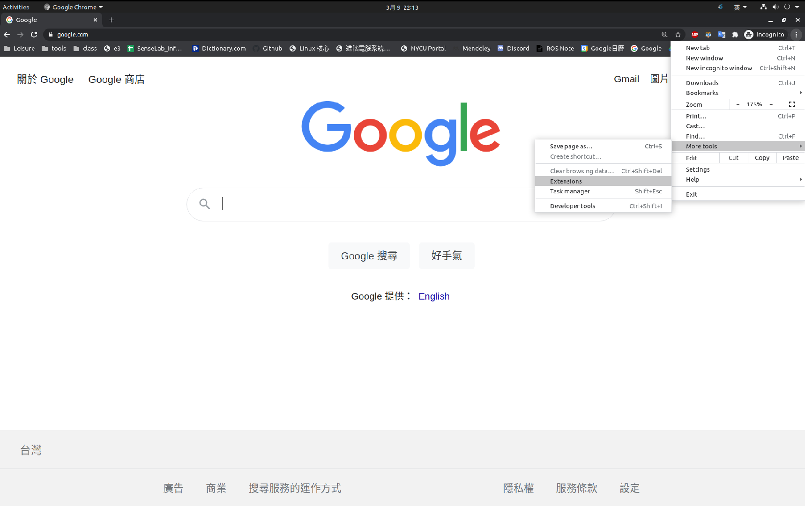
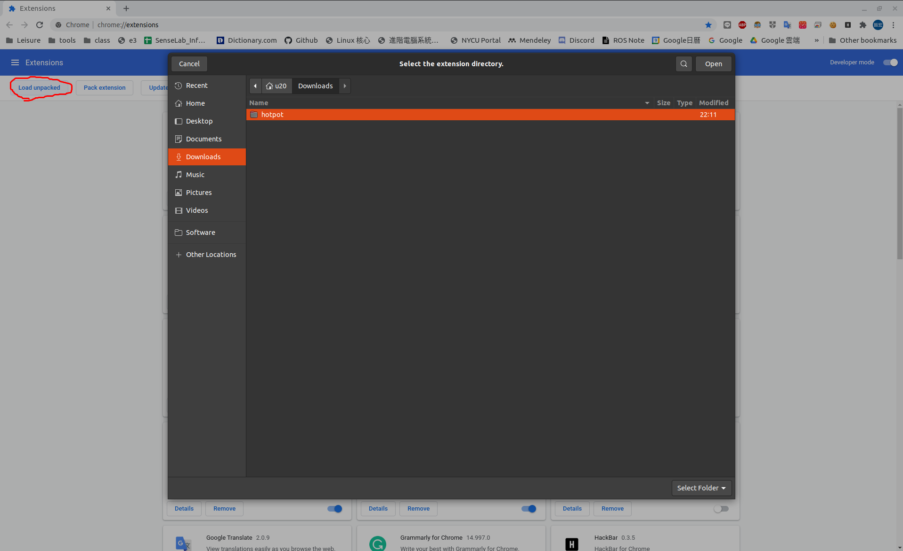
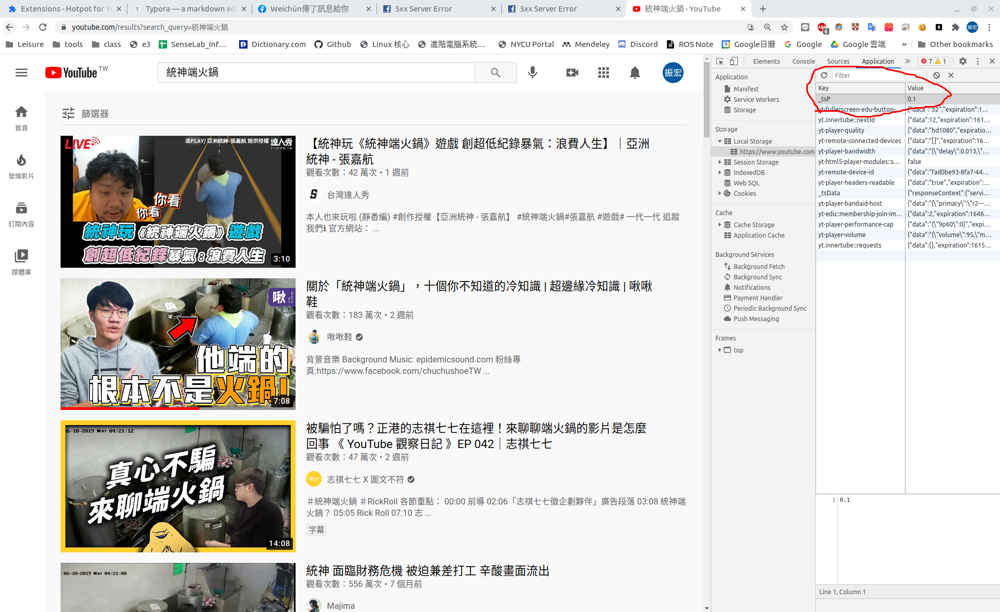

# chrome 統神端火鍋惡意廣告插件

## 安專教學
1. 下載專案

2. 點選 chrome `More tools -> Extentions` 打開套件管理

   

3. 點選 `Load unpacked` 並打開剛剛下載的檔案

   

4. 打開 Youtube 頁面 `F12 -> Local Storage -> https://www.youtube.com`，新增欄位變數名稱為 `_tsP`，Value 為影片播放的機率

